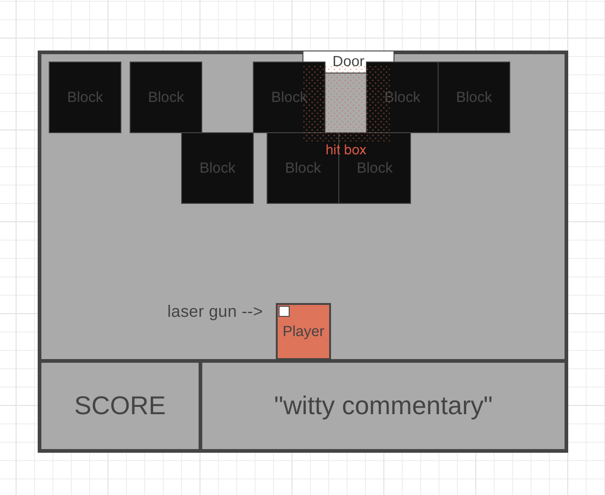

Dungeon of Doom

The year is 3020.

::next gen door slide sound::

An A.I. screen lights up and starts to talk: 

"Welcome intrepid adventurer. Turns out you're not very good at this and have managed to trap yourself in a room that is slowly growing smaller...ancient earth temples and all that. Happily, you thought to bring your handy laser gun. Blast the blocks in front of the door to escape certain doom. Or you know...don't. Good luck!"

How To Play:
- the player moves only left [A] or right [D] at the bottom of the screen (room)
- the player can fire a laser beam by pressing [Enter].
- the projectile laser beam can only move on a linear path
- blocks are randomly placed in the top two rows of the screen (room)
- the exit door is randomly placed along the top line of the screen (along the x = 0 line)
- the ceiling will drop down after a specified interval, effectively making the room smaller
- if the player comes in contact with a block, they die
- clearing a path to the door wins the game

Tech:
- HTML
- CSS
- JavaScript
- Canvas

MVP:
* player icon that moves left and right at the bottom of the screen
* two rows of "blocks" that randomly place themselves withing the following parameters:
    - there are six blocks on the top row
    - there are five blocks on the bottom row
* a door that randomly places itself along the x = 0 axis
* a "laser gun" function that fires laser bullets at the blocks to "break them apart"
* a win function that recognizes when a path has been cleared
* an interval function that drops the top of the screen every 15 seconds 
* a lose function that recognizes when the player collides with a box
* number of wins in the lower lefthand corner
* text box below that announces 
    - start
    - win or lose
* block "dungeon" design

3-ish Stretch Goals:
* when game won, player can move in a straight path to/through the door to initialize the next round
* persistent local storage of score
* futuristic themed game with small character and realistic laser bullets
* reset button
* detecting when there's only one block left in the "hit box" and noting "Almost there! Fire at will."
* text box below fills with witty commentary after each shot
* sound!
    - actual door sound at beginning of game
    - laser "pew pew" sounds when firing
    - doom music
    - "hooray" for win and "squish" for lose 
* create movement buttons for mobile users
* random number of blocks filling both rows
* create a setting that ensures there are *always* blocks in front of the door

Super Stretch!:
* different color blocks take different "hit" counts to destroy

UPDATES (while coding):
👾 # of Blocks: Noticed that five boxes on the top row and three on the second row were too few to be any challenge for the game. Increased to six boxes randomly populated on the top row and five on the second row.